Currently, the primary function of CatGen is for automated enumeration of various systems of atoms and other catalytically relevant properties. This is performed through symmetries which exist in these chemical systems. These symmetries take the form of translations and rotations in bulk structures where well defined lattices exist. For gas-phase, symmetries are defined through bonds formation rules.

By conserving bond-formation order and pairing it with bulk symmetry enumerations, a comprehensive mapping tools of all possible relevant chemical pathways can be produced. This information can then be aggregated and used to gain insights into catalytic systems.

Current enumerations include:

-   [X] Surfaces structures
-   [X] Adsorption sites
-   [X] Catalytic structures
-   [X] Gas phase molecules
-   [X] Reaction mechanisms
-   [X] Reaction routes

# Enumerations

## Surface module:

The surface module is designed to leverage information about the bulk structure which a slab is derived from.

-   [X] Surfaces produced from all user defined bulk lattices
-   [X] Any miller indices
-   [X] Unique terminations of possible surfaces
-   [X] Surface atom identification
-   [X] Voronoi connectivity of slab atoms
-   [X] Enumerate surface adsorption sites

### Slab enumeration:

Example surface generation for the 2 terminations of a fcc(2, 1, 1) surface construction of an L10 CuPd3 cubic alloy.

First termination of 9 layer slab of CuPd3.
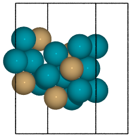 

Second termination of 9 layer slab of CuPd3.
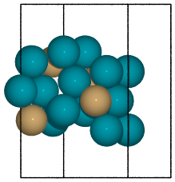 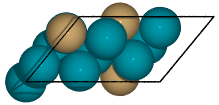

    from catgen.surface import SlabGenerator
    from ase.io import write
    from ase.build import bulk
    
    # Make a test slab
    atoms = bulk('Pd', 'fcc', a=4, cubic=True)
    atoms[3].symbol = 'Cu'
    
    gen = SlabGenerator(
        atoms,
        miller_index=(2, 1, 1),
        layers=9,
        fixed=5,
        vacuum=4)
    
    terminations = gen.get_unique_terminations()
    for i, t in enumerate(terminations):
        slab = gen.get_slab(iterm=i)
    
        # Create side and top-down visuals
        img_name = '../images/CuPd3-term-{}.pov'.format(i)
        write(
            img_name,
            slab,
            show_unit_cell=2,
            rotation='-90x',
            run_povray=True)
    
        write(
            img_name.replace('.pov', '-top.pov'),
            slab,
            show_unit_cell=2,
            run_povray=True)

### Slab graph and surface atoms:

One of the less visual features is the identification of the surface atoms and identification of nearest-neighbors which is subsequently used for creating graph edges. When performing more sophisticated operations, such as adsorption site identification, these functions are being called automatically.

Slab of hcp Pd with (1, 1, 0) miller index. Top surface atoms have been changed to Au. 

    from catgen.surface import SlabGenerator
    from ase.build import bulk
    from ase.io import write
    from ase import Atom
    
    bulk = bulk('Pd', 'hcp', a=3, cubic=True)
    
    gen = SlabGenerator(
        bulk,
        miller_index=(1, 1, 0),
        layers=6,
        fixed=2,
        vacuum=4)
    
    atoms = gen.get_slab()
    con_matrix = gen.get_graph_from_bulk(atoms, attach=True)
    print(con_matrix)
    
    # We can identify both top and bottom sites.
    top, bottom = gen.get_voronoi_surface_atoms(atoms)
    atoms.set_surface_atoms(top)
    
    for i in top:
        atoms[i].symbol = 'Au'
    
    write(
        '../images/Pd-surface-atoms.pov',
        atoms,
        show_unit_cell=2,
        rotation='-90x',
        run_povray=True)

[[0. 2. 2. 2. 1. 0. 0. 0. 0. 0. 0. 0.]
 [2. 0. 2. 2. 0. 1. 0. 0. 0. 0. 0. 0.]
 [2. 2. 0. 2. 2. 2. 1. 0. 0. 0. 0. 0.]
 [2. 2. 2. 0. 2. 2. 0. 1. 0. 0. 0. 0.]
 [1. 0. 2. 2. 0. 2. 2. 2. 1. 0. 0. 0.]
 [0. 1. 2. 2. 2. 0. 2. 2. 0. 1. 0. 0.]
 [0. 0. 1. 0. 2. 2. 0. 2. 2. 2. 1. 0.]
 [0. 0. 0. 1. 2. 2. 2. 0. 2. 2. 0. 1.]
 [0. 0. 0. 0. 1. 0. 2. 2. 0. 2. 2. 2.]
 [0. 0. 0. 0. 0. 1. 2. 2. 2. 0. 2. 2.]
 [0. 0. 0. 0. 0. 0. 1. 0. 2. 2. 0. 2.]
 [0. 0. 0. 0. 0. 0. 0. 1. 2. 2. 2. 0.]]

By using the \`\`attach'' flag this connectivity matrix has already been converted into a NetworkX graph and attached to the Gratoms object for future use.

### Simple site enumeration:

With a generated slab, we can also produce the unique adsorption sites which would be present on a given surface.

. Green denote 3-fold hollows, white are bridge, and red are top sites.")

    from catgen.surface import SlabGenerator
    from ase.build import bulk
    from ase.io import write
    from ase import Atom
    
    bulk = bulk('Pd', 'fcc', a=5, cubic=True)
    bulk[3].symbol = 'Cu'
    
    gen = SlabGenerator(
        bulk,
        miller_index=(1, 1, 1),
        layers=3,
        fixed=2,
        vacuum=10)
    
    atoms = gen.get_slab(primitive=True)
    coordinates, connectivity = gen.adsorption_sites(atoms)
    
    atm = {1: 'X', 2: 'He', 3: 'F'}
    for i, c in enumerate(coordinates):
        typ = connectivity[i]
        atoms += Atom(atm[typ], c + [0, 0, 2])
    
    write(
        '../images/CuPd3_111-sites.pov',
        atoms,
        show_unit_cell=2,
        run_povray=True)

## Adsorption module

Using the `AdsorptionSites` class form the adsorption module provides more powerful tools for surface site enumeration.

-   [X] Adsorption site enumeration based on user defined surface atoms.
-   [X] 1st and 2nd (rank) nearest neighbor topology of surface atoms.
-   [X] Connectivity of adsorption site (hollow = 3, bridge = 2, top = 1)
-   [X] 2D adsorption coordinates relative to miller index.
-   [X] Adsorption vectors for accurate 3D projection.
-   [X] Connectivity between adsorption sites

### \`\`Manual'' Adsorption site enumeration and visualization:

Adsorption site enumeration in CatGen is solely dependent upon surface atom identification. This can be performed automatically using `catgen.surface.SlabGenerator`, however, this function relies upon bulk properties which are not always available.

Here, we show how the surface sites can be assigned manually which is often convenient enough. Other means of surface site identification will be added in a future release.

Surface atoms are used to define top sites (green), which are then used to define remaining sites (red) via Delaunay triangulation symmetries.
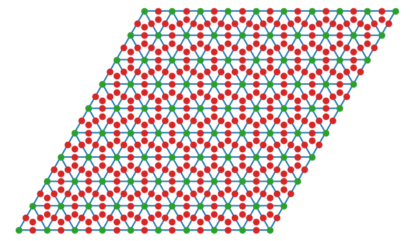

    from catgen.adsorption import AdsorptionSites
    from catgen.surface import SlabGenerator
    from ase.build import bulk
    
    bulk = bulk('Pd', 'fcc', a=5, cubic=True)
    bulk[3].symbol = 'Cu'
    
    gen = SlabGenerator(
        bulk,
        miller_index=(1, 1, 1),
        layers=3,
        vacuum=4)
    
    atoms = gen.get_slab(primitive=True)
    atoms.set_surface_atoms([8, 9, 10, 11])
    
    sites = AdsorptionSites(atoms)
    sites.plot('../images/Pd3Cu-adsorption-sites.png')

### Extended site enumeration:

For more complex adsorption enumeration, we often require more detailed information 

The `AdsorptionSite` class also produces an expanded unit cell which is useful for operations which require observation of periodic boundary conditions. This extended unit cell can be accessed by toggling the \`\`screen'' argument.

All possible adsorption sites of of CuPd3 (3, 2, 1). Site identifications are the same as above with the addition of blue which shows 4-fold hollow sites.
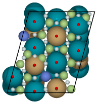

    from catgen.adsorption import AdsorptionSites
    from catgen.surface import SlabGenerator
    from ase.build import bulk
    from ase.io import write
    from ase import Atom
    
    bulk = bulk('Pd', 'fcc', a=5, cubic=True)
    bulk[3].symbol = 'Cu'
    
    gen = SlabGenerator(
        bulk,
        miller_index=(3, 2, 1),
        layers=13,
        vacuum=5)
    
    atoms = gen.get_slab(primitive=True)
    
    top, _ = gen.get_voronoi_surface_atoms(atoms)
    atoms.set_surface_atoms(top)
    sites = AdsorptionSites(atoms)
    
    # Positon of each site
    coordinates = sites.get_coordinates()
    
    # Number of adjacent surface atoms
    connectivity = sites.get_connectivity()
    
    # The indices of adjacent surface atoms
    topology = sites.get_topology()
    
    # Only print every 5th entry.
    print('Coordinates:\n', coordinates[::5], '\n')
    print('Connectivity:\n', connectivity[::5], '\n')
    print('Topology:\n', topology[::5], '\n')
    
    periodic = sites.get_periodic_sites()
    print('Sites by periodicity:\n', periodic[::5], '\n')
    
    symmetric = sites.get_symmetric_sites()
    print('Sites by symmetry:\n', symmetric[::5])
    
    atm = {1: 'X', 2: 'He', 3: 'F', 4: 'N'}
    for i, c in enumerate(coordinates):
        typ = connectivity[i]
        atoms += Atom(atm[typ], c + [0, 0, 2])
    
    
    write(
        '../images/CuPd3_321-sites.pov',
        atoms,
        show_unit_cell=2,
        run_povray=True)

When we call `get_periodic_sites()`, we see that some indices are repeated. This is to indicate that these sites are identical in the context of periodic boundaries. If we set `screen` to True, we will only be given the sites within the original unit cell (between 0-1 in fractional coordinates) and all indices will be unique.

In this case there are no symmetrically reducible sites, so `get_symmetric_sites()` returns the same result.

NOTE: The indices of the periodic and symmetry site functions are in reference to the extended unit cell.

### Adsorption vectors

The most commonly studied miller indices, such as fcc(1, 1, 1), produce a flat surface. This means the most favorable angle of adsorption will always be perpendicular to the surface. This is not always the case for higher miller indices. 

CatGen defines the most favorable vector for adsorption as the one which is furthest from all neighboring surface atoms. This vector is important for the generation of sensible 3D structures from graph enumerations. This is particularly true for adsorbates with multiple atoms.

 on a CuPd3 (2, 1, 1) surface.")

    from catgen.adsorption import AdsorptionSites
    from catgen.surface import SlabGenerator
    from ase.build import bulk
    from ase.io import write
    from ase import Atom
    import numpy as np
    
    bulk = bulk('Pd', 'fcc', a=5, cubic=True)
    bulk[3].symbol = 'Cu'
    
    gen = SlabGenerator(
        bulk,
        miller_index=(2, 1, 1),
        layers=10,
        vacuum=5)
    
    atoms = gen.get_slab(primitive=True)
    
    top, _ = gen.get_voronoi_surface_atoms(atoms, attach_graph=False)
    atoms.set_surface_atoms(top)
    sites = AdsorptionSites(atoms)
    
    coordinates = sites.get_coordinates()
    vectors = sites.get_adsorption_vectors()
    
    heights = np.arange(0, 2, 0.25)
    for i, c in enumerate(coordinates):
        for h in heights:
            atoms += Atom('X', c + vectors[i] * h)
    
    atoms.wrap()
    write(
        '../images/adsorption-vectors.pov',
        atoms * (1, 2, 1),
        show_unit_cell=2,
        rotation='-90x, 90y, 20z',
        run_povray=True)

### Adsorption structure builder

Creating good initial guesses for 3D structures can be tedious to perform by hand, even small molecules. The `Builder` module in the adsorption package seeks to help automate this task.

The `Builder` module currently takes two Gratoms objects as input since graph information is required. 

    from catgen.surface import SlabGenerator
    from catgen.adsorption import Builder
    from ase.build import bulk
    import numpy as np
    
    atoms = bulk('Pd', 'fcc', a=4, cubic=True)
    atoms[3].symbol = 'Cu'
    
    gen = SlabGenerator(
        atoms,
        miller_index=[1, 1, 1],
        layers=4,
        fixed=2,
        vacuum=10)
    
    slab = gen.get_slab()
    
    # Use the slab generator to attach a graph in this step
    surface_sites = gen.get_voronoi_surface_atoms(slab)[0]
    slab.set_surface_atoms(surface_sites)
    
    builder = Builder(slab)
    print(builder)

Adsorption builder for Cu4Pd12 slab.
unique adsorption sites: 9
site connectivity: [1 1 2 2 2 3 3 3 3]
unique adsorption edges: 21

1.  Monodentate adsorption

    When a single atom of the molecule is considered bonded to the surface, the builder attempts to arrange non-bonded atoms in an intelligent fashion.
    
    In this example, the use of `-1` as a tag on the adsorbate is used to indicate it is bonded to the slab.
    
    
    
    
    
        from catgen.pathways import ReactionNetwork
        from catgen.surface import SlabGenerator
        from catgen.adsorption import Builder
        from ase.build import bulk
        from ase.io import write
        import numpy as np
        
        atoms = bulk('Pd', 'fcc', a=4, cubic=True)
        atoms[3].symbol = 'Cu'
        
        gen = SlabGenerator(
            atoms,
            miller_index=[1, 1, 1],
            layers=4,
            vacuum=4)
        
        slab = gen.get_slab()
        surface_sites = gen.get_voronoi_surface_atoms(slab)[0]
        slab.set_surface_atoms(surface_sites)
        
        with ReactionNetwork(db_name='C2H6-example.db') as rn:
            rn.molecule_search({'C': 2, 'H': 6})
            molecules = rn.load_molecules()
        
        adsorbate = molecules[8]
        adsorbate.set_tags([0, -1, 0, 0])
        
        builder = Builder(slab)
        ads_slab = builder.add_adsorbate(adsorbate, index=1)
        
        img_name = '../images/CH3-ads.pov'
        write(
            img_name,
            ads_slab,
            show_unit_cell=2,
            rotation='-90x',
            run_povray=True)
        
        write(
            img_name.replace('.pov', '-top.pov'),
            ads_slab,
            show_unit_cell=2,
            run_povray=True)

2.  Bidentate adsorption

    The `Builder` class can also produce structures for species bonded in two locations. In this example, indexing of the atoms which bond to the surface is done with the `bonds` key.
    
    Also, using setting the `index` key to `-1` will return a list of all the possible adsorbed structures.
    
    
    
    
    
        from catgen.pathways import ReactionNetwork
        from catgen.surface import SlabGenerator
        from catgen.adsorption import Builder
        from ase.build import bulk
        from ase.io import write
        import numpy as np
        
        atoms = bulk('Pd', 'fcc', a=4, cubic=True)
        atoms[3].symbol = 'Cu'
        
        gen = SlabGenerator(
            atoms,
            miller_index=[1, 1, 1],
            layers=4,
            vacuum=4)
        
        slab = gen.get_slab()
        surface_sites = gen.get_voronoi_surface_atoms(slab)[0]
        slab.set_surface_atoms(surface_sites)
        
        with ReactionNetwork(db_name='C2H6-example.db') as rn:
            rn.molecule_search({'C': 2, 'H': 6})
            molecules = rn.load_molecules()
        
        adsorbate = molecules[13]
        
        builder = Builder(slab)
        ads_slab = builder.add_adsorbate(adsorbate, bonds=[1, 3], index=-1)
        
        print('{} adsorption structures generated'.format(len(ads_slab)))
        
        img_name = '../images/CH2CH-ads.pov'
        write(
            img_name,
            ads_slab[14],
            show_unit_cell=2,
            rotation='-90x',
            run_povray=True)
        
        write(
            img_name.replace('.pov', '-top.pov'),
            ads_slab[14],
            show_unit_cell=2,
            run_povray=True)

## Gas-phase:

-   [X] Various chemical species (C, H, and O currently tested)
-   [X] Molecules with single bonds
-   [X] Molecules with double bonds
-   [X] Molecules with triple bonds
-   [X] Molecules with single cyclical groups
-   [X] Molecules with double cyclical groups
-   [X] Molecules with triple cyclical groups
-   [X] UFF 3D structure predictions

### Example usage:

Below is an example script which generates some simple figures using [NetworkX](https://networkx.github.io/documentation/networkx-1.10/index.html) code for all molecules up to C2H6.

1 
2 
3 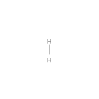
4 
5 
6 
7 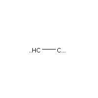
8 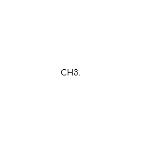
9 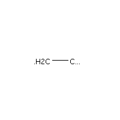
10 
11 
12 
13 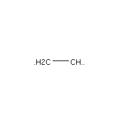
14 
15 
16 
17 

    from catgen.pathways import ReactionNetwork
    import time
    
    start = time.time()
    
    db_name = 'C2H6-example.db'
    with ReactionNetwork(db_name=db_name) as rn:
    
        # Run a molecule search
        rn.molecule_search(
            element_pool={'C': 2, 'H': 6},
            multiple_bond_search=False)
    
        # Load the molecules
        molecules = rn.load_molecules()
    
        # Get 3D structure estimates (requires RDKit)
        try:
            from catgen.api.rd_kit import plot_molecule, get_uff_coordinates
    
            for i, molecule in molecules.items():
                plot_molecule(
                    molecule,
                    file_name='../images/molecule-{}.png'.format(i))
    
                molecule = get_uff_coordinates(molecule, steps=50)
                rn.save_3d_structure(molecule)
    
            images = rn.load_3d_structures()
        except(ImportError):
           pass
    
    print('Process completed in {:.1f}s'.format(time.time() - start))

Process completed in 22.4s

## Reaction mechanisms:

-   [X] Addition and Reduction reactions (R1 + R2 <&#x2013;> P1)
-   [X] Bond formation / breaking pathways (R1 <&#x2013;> P1)
-   [X] Reconfiguration reactions (R1 <&#x2013;> R1\*)
-   [X] Substitution reactions (R1 + R2 <&#x2013;> P1 + P2)

### Reaction networks:

Enumeration of possible elementary reaction steps for gas-phase C2H6 species.

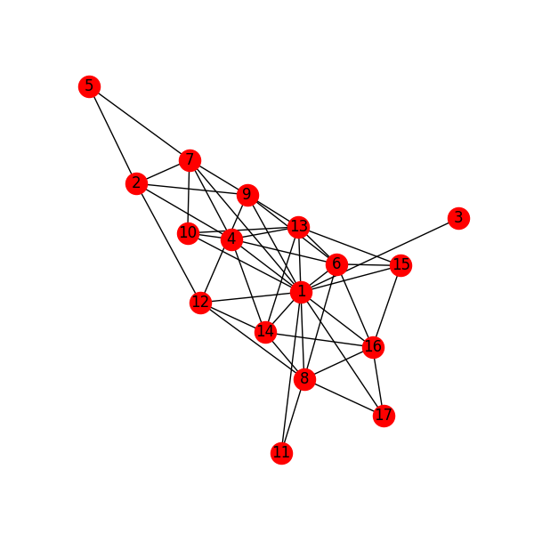

Pathway exploration is currently integrated with gas-phase molecule search. See the gas-phase molecule search example for further details on molecule generations. Below, a reaction network is generated.

    from catgen.pathways import ReactionNetwork
    import time
    
    start = time.time()
    
    # Load existing database
    db_name = 'C2H6-example.db'
    
    with ReactionNetwork(db_name=db_name) as rn:
        # Substitution pathway search is expensive!
        rn.path_search(
            reconfiguration=False,
            substitution=False)
    
        rn.plot_reaction_network(file_name='../images/reaction-network.png')
    
    print('Process completed in {:.1f}s'.format(time.time() - start))

Process completed in 0.4s

Once the reaction network has been produce, we can illustrate the potential pathways using the following code.

    from catgen.pathways import ReactionNetwork
    import numpy as np
    import networkx as nx
    from ase.utils import formula_hill
    
    with ReactionNetwork(db_name='C2H6-example.db') as rn:
        molecules = rn.load_molecules()
        pathways = rn.load_pathways()
    
    names = np.empty(len(molecules) + 1, dtype='a5')
    names[0] = ''
    for k, v in molecules.items():
        atn = nx.get_node_attributes(v.graph, 'number')
    
        # These are not always unique identifiers
        hill = formula_hill(list(atn.values()))
        names[k] = hill
    
    for path in pathways:
        print('|{} + {} --> {} + {}|'.format(*names[path]))

<table border="2" cellspacing="0" cellpadding="6" rules="groups" frame="hsides">

<colgroup>
<col  class="org-left" />
</colgroup>
<tbody>
<tr>
<td class="org-left">b'H' + b'H' &#x2013;> b'' + b'H2'</td>
</tr>

<tr>
<td class="org-left">b'H' + b'C' &#x2013;> b'' + b'CH'</td>
</tr>

<tr>
<td class="org-left">b'H' + b'CH' &#x2013;> b'' + b'CH2'</td>
</tr>

<tr>
<td class="org-left">b'H' + b'C2' &#x2013;> b'' + b'C2H'</td>
</tr>

<tr>
<td class="org-left">b'H' + b'CH2' &#x2013;> b'' + b'CH3'</td>
</tr>

<tr>
<td class="org-left">b'H' + b'C2H' &#x2013;> b'' + b'C2H2'</td>
</tr>

<tr>
<td class="org-left">b'H' + b'C2H' &#x2013;> b'' + b'C2H2'</td>
</tr>

<tr>
<td class="org-left">b'H' + b'CH3' &#x2013;> b'' + b'CH4'</td>
</tr>

<tr>
<td class="org-left">b'H' + b'C2H2' &#x2013;> b'' + b'C2H3'</td>
</tr>

<tr>
<td class="org-left">b'H' + b'C2H2' &#x2013;> b'' + b'C2H3'</td>
</tr>

<tr>
<td class="org-left">b'H' + b'C2H2' &#x2013;> b'' + b'C2H3'</td>
</tr>

<tr>
<td class="org-left">b'H' + b'C2H3' &#x2013;> b'' + b'C2H4'</td>
</tr>

<tr>
<td class="org-left">b'H' + b'C2H3' &#x2013;> b'' + b'C2H4'</td>
</tr>

<tr>
<td class="org-left">b'H' + b'C2H3' &#x2013;> b'' + b'C2H4'</td>
</tr>

<tr>
<td class="org-left">b'H' + b'C2H4' &#x2013;> b'' + b'C2H5'</td>
</tr>

<tr>
<td class="org-left">b'H' + b'C2H4' &#x2013;> b'' + b'C2H5'</td>
</tr>

<tr>
<td class="org-left">b'H' + b'C2H5' &#x2013;> b'' + b'C2H6'</td>
</tr>

<tr>
<td class="org-left">b'C' + b'C' &#x2013;> b'' + b'C2'</td>
</tr>

<tr>
<td class="org-left">b'C' + b'CH' &#x2013;> b'' + b'C2H'</td>
</tr>

<tr>
<td class="org-left">b'C' + b'CH2' &#x2013;> b'' + b'C2H2'</td>
</tr>

<tr>
<td class="org-left">b'C' + b'CH3' &#x2013;> b'' + b'C2H3'</td>
</tr>

<tr>
<td class="org-left">b'CH' + b'CH' &#x2013;> b'' + b'C2H2'</td>
</tr>

<tr>
<td class="org-left">b'CH' + b'CH2' &#x2013;> b'' + b'C2H3'</td>
</tr>

<tr>
<td class="org-left">b'CH' + b'CH3' &#x2013;> b'' + b'C2H4'</td>
</tr>

<tr>
<td class="org-left">b'CH2' + b'CH2' &#x2013;> b'' + b'C2H4'</td>
</tr>

<tr>
<td class="org-left">b'CH2' + b'CH3' &#x2013;> b'' + b'C2H5'</td>
</tr>

<tr>
<td class="org-left">b'CH3' + b'CH3' &#x2013;> b'' + b'C2H6'</td>
</tr>
</tbody>
</table>

## Reaction routes

-   [X] Overall/Response reaction routes
-   [X] Linearly independent set of reaction routes
-   [X] Complete set of full reaction routes
-   [X] Complete set of empty reaction routes
-   [ ] Graph based enumeration

### Overall/Response reaction routes

For a given set of elementary mechanisms, there is frequently many types of chemistry which could be considered simultaneously. As an example, we reproduce an example from the original literature which the algorithm is adopted from <a href="#fishtik-2004-new-approac" title="Ilie Fishtik \&amp; Ravindra Datta, A New Approach for the Classification and  Enumeration OF Unique Reaction Routes and Unique  Overall Reactions in Multiple Chemical Reaction  Systems, {Chemical Engineering Communications}, v(3), 373-397 (2004).">fishtik-2004-new-approac</a>.

In this example, we choose the number of independent species.

    from catgen.route import get_response_reactions
    import numpy as np
    
    epsilon = np.array([
        # To keep indexing consistent
        [ 0, 0, 0, 0],  # I1
        [ 0, 0, 0, 0],  # I2
        [ 0, 0, 0, 0],  # I3
        [ 0, 0, 0, 0],  # I4
        [ 0, 0, 0, 0],  # I5
        # C  N  H  O
        [ 1, 0, 4, 0],  # CH4
        [ 0, 1, 0, 1],  # NO
        [ 0, 0, 0, 2],  # O2
        [ 0, 2, 0, 0],  # N2
        [ 1, 0, 0, 1],  # CO
        [ 1, 0, 0, 2],  # CO2
        [ 0, 0, 2, 1],  # H2O
    ])
    
    terminal = [5, 6, 7, 8, 9, 10, 11]
    OR, species = get_response_reactions(epsilon, terminal, species=True)
    
    print('Overall reaction routes:')
    print(OR, '\n')
    
    print('Terminal species:')
    print(species)

Overall reaction routes:
[[ 0  0  0  0  0  0  2 -1 -1  0  0  0]
 [ 0  0  0  0  0  0  0  1  0  2 -2  0]
 [ 0  0  0  0  0  2  0  3  0 -2  0 -4]
 [ 0  0  0  0  0  1  0  2  0  0 -1 -2]
 [ 0  0  0  0  0  0  2  0 -1  2 -2  0]
 [ 0  0  0  0  0  2  6  0 -3 -2  0 -4]
 [ 0  0  0  0  0  1  4  0 -2  0 -1 -2]
 [ 0  0  0  0  0  1  0  0  0 -4  3 -2]] 

Terminal species:
[[ 5  6  7  8  9]
 [ 5  6  7  9 10]
 [ 5  6  7  9 11]
 [ 5  6  7 10 11]
 [ 5  6  8  9 10]
 [ 5  6  8  9 11]
 [ 5  6  8 10 11]
 [ 5  6  9 10 11]]

The terminal species matrix will always contain `s + 1` entries, where `s` is the number of elements in the chemistry. This does not necessarily mean that the overall reaction produced will include all `s + 1` species.

### Linearly independent set

Currently, only Happel-Sellers reaction routes can be enumerated <a href="#fishtik-2004-new-approac" title="Ilie Fishtik \&amp; Ravindra Datta, A New Approach for the Classification and  Enumeration OF Unique Reaction Routes and Unique  Overall Reactions in Multiple Chemical Reaction  Systems, {Chemical Engineering Communications}, v(3), 373-397 (2004).">fishtik-2004-new-approac</a>. These routes require that the user choose a number of terminal species equal to `s + 1`. The terminal species selected will only produce overall reactions associated with the chemistry which is enumerated in the previous example.

Below we take another example from to produce a linearly independent set of reaction routes <a href="#fishtik-2004-react-route-graph-2" title="Ilie Fishtik, Caitlin Callaghan, Ravindra \&amp; Datta, Reaction Route Graphs. {II}. Examples of Enzyme- and  Surface-Catalyzed Single Overall Reactions, {The Journal of Physical Chemistry B}, v(18), 5683-5697 (2004).">fishtik-2004-react-route-graph-2</a>.

    from catgen.route import get_response_reactions
    from catgen.route import get_heppel_sellers
    import numpy as np
    
    nu = np.array([
        # H2Os, COs, CO2s, H2s, Hs, OHs, Os, HCOOs, H2O, CO, CO2, H2
        [   0,   1,   0,   0,   0,   0,   0,   0,   0,  -1,   0,   0],  # s1
        [   1,   0,   0,   0,   0,   0,   0,   0,  -1,   0,   0,   0],  # s2
        [   0,   0,  -1,   0,   0,   0,   0,   0,   0,   0,   1,   0],  # s3
        [   0,   0,   0,   1,  -2,   0,   0,   0,   0,   0,   0,   0],  # s4
        [   0,   0,   0,  -1,   0,   0,   0,   0,   0,   0,   0,   1],  # s5
        [  -1,   0,   0,   0,   1,   1,   0,   0,   0,   0,   0,   0],  # s6
        [   0,  -1 ,  1,   0,   0,   0,  -1,   0,   0,   0,   0,   0],  # s7
        [   0,  -1,   0,   0,   0,  -1,   0,   1,   0,   0,   0,   0],  # s8
        [   0,   0,   0,   0,   1,  -1,   1,   0,   0,   0,   0,   0],  # s9
        [   0,  -1,   1,   0,   1,  -1,   0,   0,   0,   0,   0,   0],  # s10
        [   0,   0,   1,   0,   1,   0,   0,  -1,   0,   0,   0,   0],  # s11
        [   0,   0,   1,   0,   0,   1,  -1,  -1,   0,   0,   0,   0],  # s12
        [  -1,   0,   0,   1,  -1,   1,   0,   0,   0,   0,   0,   0],  # s14
        [   0,   0,   0,   1,  -1,  -1,   1,   0,   0,   0,   0,   0],  # s15
        [   0,   0,   1,   1,  -1,   0,   0,  -1,   0,   0,   0,   0],  # s17
    ])
    
    epsilon = np.array([
        # Just a place holder
        [ 0, 0, 0],  # H2OS
        [ 0, 0, 0],  # COS
        [ 0, 0, 0],  # CO2S
        [ 0, 0, 0],  # H2S
        [ 0, 0, 0],  # HS
        [ 0, 0, 0],  # OHS
        [ 0, 0, 0],  # OS
        [ 0, 0, 0],  # HCOOS
        # C, H, O
        [ 0, 2, 1],  # H2O
        [ 1, 0, 1],  # CO
        [ 1, 0, 2],  # CO2
        [ 0, 2, 0],  # H2
    ])
    
    # Indices of the terminal species
    terminal = [8, 9, 10, 11]
    
    RER, species = get_response_reactions(epsilon, terminal, species=True)
    sigma = get_heppel_sellers(nu, species[0])
    
    print('Linearly independent set of reaction routes:')
    print(sigma, '\n')
    
    print('Overall reaction routes:')
    print(np.dot(sigma, nu))

Linearly independent set of reaction routes:
[[ 1  1  1  1  1  1  1  0  1  0  0  0  0  0  0]
 [ 1  1  1  1  1  1  0  0  0  1  0  0  0  0  0]
 [ 1  1  1  1  1  1  0  1  0  0  1  0  0  0  0]
 [ 0  0  0  0  0  0  1 -1  0  0  0 -1  0  0  0]
 [ 0  0  0  1  0  1  0  0  0  0  0  0 -1  0  0]
 [ 1  1  1  0  1  1  1  0  0  0  0  0  0  1  0]
 [ 1  1  1  0  1  1  0  1  0  0  0  0  0  0  1]] 

Overall reaction routes:
[[ 0  0  0  0  0  0  0  0 -1 -1  1  1]
 [ 0  0  0  0  0  0  0  0 -1 -1  1  1]
 [ 0  0  0  0  0  0  0  0 -1 -1  1  1]
 [ 0  0  0  0  0  0  0  0  0  0  0  0]
 [ 0  0  0  0  0  0  0  0  0  0  0  0]
 [ 0  0  0  0  0  0  0  0 -1 -1  1  1]
 [ 0  0  0  0  0  0  0  0 -1 -1  1  1]]

Note that all of the linearly independent reaction routes return the same overall reaction except for one. This is because some routes will return a trivial solution. Routes which return the correct overall chemistry are known as full routes (FR) and those which return trivial solutions are called empty routes (ER).

### Complete full and empty enumeration

Computationally, collecting an arbitrary set of linearly independent reaction routes is computationally inexpensive and can potentially be useful on its own. Complete enumeration techniques currently implemented in CatGen become computationally infeasible with large numbers of species and elementary steps.

However, it is still often desirable for some applications to have a full listing of both full and empty reaction routes. This can be achieved more efficiently when beginning with a linearly independent set of reaction routes <a href="#fishtik-2002-ubi-qep" title="Ilie Fishtik \&amp; Ravindra Datta, A {UBI-QEP} Microkinetic Model for the Water-Gas Shift Reaction on {Cu}(111), {Surface Science}, v(3), 229-254 (2002).">fishtik-2002-ubi-qep</a>.

    from catgen.route import get_response_reactions
    from catgen.route import get_reaction_routes
    from catgen.route import get_heppel_sellers
    import numpy as np
    np.set_printoptions(threshold=np.inf)
    
    nu = np.array([
        [  1,  0,  0,  0,  0,  0,  0,  0, -1,  0,  0,  0],  # s1
        [  0,  1,  0,  0,  0,  0,  0,  0,  0, -1,  0,  0],  # s2
        [  0,  0, -1,  0,  0,  0,  0,  0,  0,  0,  1,  0],  # s3
        [  0,  0,  0,  1, -2,  0,  0,  0,  0,  0,  0,  0],  # s4
        [  0,  0,  0, -1,  0,  0,  0,  0,  0,  0,  0,  1],  # s5
        [ -1,  0,  0,  0,  1,  1,  0,  0,  0,  0,  0,  0],  # s6
        [  0, -1,  1,  0,  0,  0, -1,  0,  0,  0,  0,  0],  # s7
        [  0, -1,  0,  0,  0, -1,  0,  1,  0,  0,  0,  0],  # s8
        [  0,  0,  0,  0,  1, -1,  1,  0,  0,  0,  0,  0],  # s9
        [  0, -1,  1,  0,  1, -1,  0,  0,  0,  0,  0,  0],  # s10
        [  0,  0,  1,  0,  1,  0,  0, -1,  0,  0,  0,  0],  # s11
        [  0,  0,  1,  0,  0,  1, -1, -1,  0,  0,  0,  0],  # s12
        [ -1,  0,  0,  0,  0,  2, -1,  0,  0,  0,  0,  0],  # s13
    ])
    
    epsilon = np.array([
        # C, H, O
        [ 0, 2, 1],  # SH2O
        [ 1, 0, 1],  # SCO
        [ 1, 0, 2],  # SCO2
        [ 0, 2, 0],  # SH2
        [ 0, 1, 0],  # SH
        [ 0, 1, 1],  # SOH
        [ 0, 0, 1],  # SO
        [ 1, 1, 2],  # SOOCH
        [ 0, 2, 1],  # H2O
        [ 1, 0, 1],  # CO
        [ 1, 0, 2],  # CO2
        [ 0, 2, 0],  # H2
    ])
    
    
    # Indices of the species considered terminal
    terminal = [8, 9, 10, 11]
    
    RER, species = get_response_reactions(epsilon, terminal, species=True)
    sigma = get_heppel_sellers(nu, species[0])
    FR, ER = get_reaction_routes(nu, sigma)
    
    print('{} Full reaction routes:'.format(len(FR)))
    print(FR, '\n')
    
    print('{} Empty reaction routes:'.format(len(ER)))
    print(ER)

17 Full reaction routes:
[[ 1  1  1  1  1  1  1  0  1  0  0  0  0]
 [ 1  1  1  1  1  1  0  0  0  1  0  0  0]
 [ 1  1  1  1  1  1  0  1  0  0  1  0  0]
 [ 1  1  1  1  1  2  1  0  0  0  0  0 -1]
 [ 1  1  1  1  1  0  0  0  0  1  1 -1  1]
 [ 1  1  1  1  1  0  0  0  1  1  0  0  1]
 [ 1  1  1  1  1  0  0  1  0  0  2 -1  1]
 [ 1  1  1  1  1  0  0 -1  0  2  0 -1  1]
 [ 1  1  1  1  1  0  0  1  2  0  0  1  1]
 [ 1  1  1  1  1  0  0  1  1  0  1  0  1]
 [ 1  1  1  1  1  0  1  0  0  0  2 -2  1]
 [ 1  1  1  1  1  0 -1  0  0  2  0  0  1]
 [ 1  1  1  1  1  0  1  0  2  0  0  0  1]
 [ 1  1  1  1  1  0 -1  2  0  0  2  0  1]
 [ 1  1  1  1  1  2  0  1  0  0  0  1 -1]
 [ 1  1  1  1  1  1  0  1  1  0  0  1  0]
 [ 1  1  1  1  1  1  1  0  0  0  1 -1  0]] 

12 Empty reaction routes:
[[ 0  0  0  0  0  0  1 -1  0  0  0 -1  0]
 [ 0  0  0  0  0  0  0  0  1  0 -1  1  0]
 [ 0  0  0  0  0  0  0  1  0 -1  1  0  0]
 [ 0  0  0  0  0  0  0  1  1 -1  0  1  0]
 [ 0  0  0  0  0  0  1  0  0 -1  1 -1  0]
 [ 0  0  0  0  0  0  1  0  1 -1  0  0  0]
 [ 0  0  0  0  0  0  1 -1  1  0 -1  0  0]
 [ 0  0  0  0  0  1  0  0  0  0 -1  1 -1]
 [ 0  0  0  0  0  1  0  0 -1  0  0  0 -1]
 [ 0  0  0  0  0  1  0  1  0 -1  0  1 -1]
 [ 0  0  0  0  0  1  1  0  0 -1  0  0 -1]
 [ 0  0  0  0  0  1  1 -1  0  0 -1  0 -1]]

